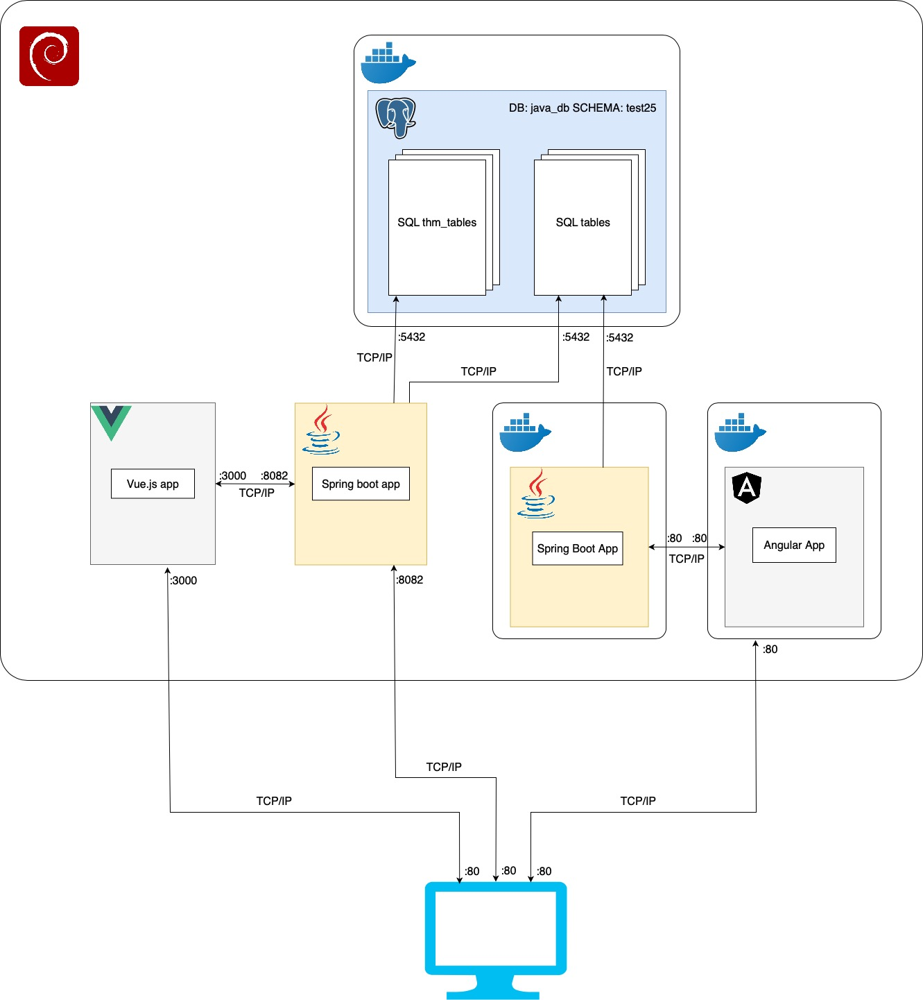

# PRI Developer Guide
*[jarrobots/PRI](https://github.com/jarrobots/PRI)*
System is extension of *https://github.com/System-PRI*
## Project Structure

```
PRI/
├── src/main/java/pl/edu/amu/wmi/
│ ├── controllers/ # REST API endpoints
│ ├── services/ # Business logic (ThesisService, ChapterService)
│ ├── repositories/ # JPA repos (ThesisRepository)
│ ├── models/ # Entities (ThmThesis, ThmChapter)
│ └── PRIApplication.java
├── src/main/resources/
│ └── application.yml # Config (DB, LDAP, thesis-module)
├── docker/ # Dockerfile + docker-compose.yml
└── deploy/ # PRODUCTION DEPLOYMENT HERE
├── docker-compose.yml
└── config.env
└── pom.xml
```
## Local Development
```
mvn clean install
mvn spring-boot:run -Dspring.profiles.active=dev
```
lub Docker: `docker-compose up --build`

**Database Privileges (REQUIRED)**  
**Module requires following privileges on schema (i.e. test25):**  
```
GRANT USAGE, CREATE ON SCHEMA test25 TO api;
GRANT SELECT ON ALL TABLES IN SCHEMA test25 TO api;
```
**Tables: thm_* prefix (thm_thesis, thm_chapter)**  
**Initial Data Generation**  

**application.yml:**  
```
text
thesis-module:
  generate-theses-and-chapters-on-startup: true  # Generates:
    # - 1 thm_thesis per project
    # - 1 thm_chapter per student (non-null project_id)
```  

**Key Config (application.yml)**  

```  
spring:
  datasource: postgresql://localhost:5432/pri
  ldap:
    urls: ldaps://dc2-2016.labs.wmi.amu.edu.pl:636
server:
  port: 8080
thesis-module:
  generate-theses-and-chapters-on-startup: true
```  

## Deployment

1. Build: mvn package -DskipTests
2. Copy JAR → deploy/
3. docker-compose up -d (w folderze deploy/)

## Testing

```
mvn test                    # Unit
mvn test -Pintegration-test # Testcontainers
```  

## Architecture


